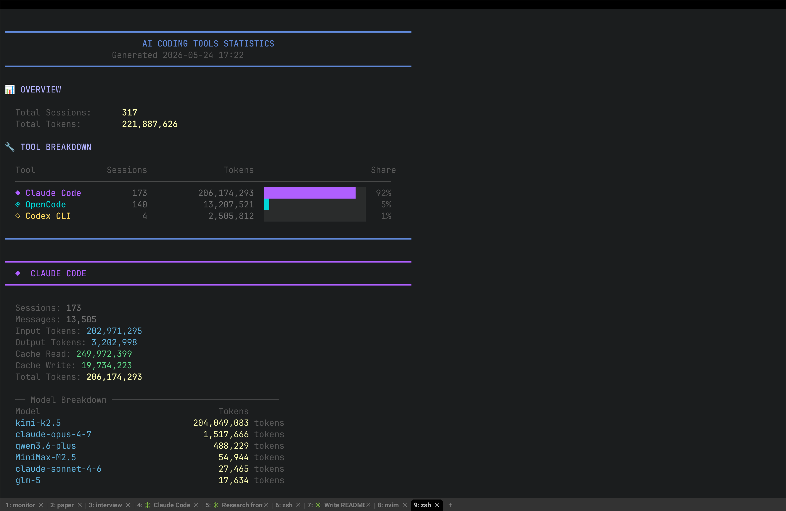

# ai-stats

> A terminal dashboard for tracking usage statistics across AI coding tools.

[中文文档](README.zh.md)

Aggregates session counts, token usage, cache efficiency, cost estimates, and extension inventory from **Claude Code**, **OpenCode**, and **Codex CLI** — all in one place. No accounts, no telemetry, reads only local data files.

```
━━━━━━━━━━━━━━━━━━━━━━━━━━━━━━━━━━━━━━━━━━━━━━━━━━━━━━━━
             AI CODING TOOLS STATISTICS
                  Generated 2025-05-24 14:32
━━━━━━━━━━━━━━━━━━━━━━━━━━━━━━━━━━━━━━━━━━━━━━━━━━━━━━━━

📊 OVERVIEW

  Total Sessions:      1,284
  Total Tokens:    9,471,032

🔧 TOOL BREAKDOWN

  Tool            Sessions               Tokens                 Share
  ──────────────────────────────────────────────────────────────────
  ◆ Claude Code        842          7,821,004  ████████████████░░░░  82%
  ◈ OpenCode           312          1,241,887  ████░░░░░░░░░░░░░░░░  13%
  ◇ Codex CLI          130            408,141  █░░░░░░░░░░░░░░░░░░░   4%
```




---

## Supported Tools

| Tool | Data Source | Format |
|------|-------------|--------|
| [Claude Code](https://claude.ai/code) | `~/.claude/stats-cache.json` | JSON |
| [OpenCode](https://github.com/sst/opencode) | `~/.local/share/opencode/opencode.db` | SQLite |
| [Codex CLI](https://github.com/openai/codex) | `~/.codex/state_5.sqlite` | SQLite |

Only tools with existing data files are shown. Missing tools are silently skipped.

---

## Requirements

| Dependency | Required | Purpose |
|------------|----------|---------|
| Bash 3.x+ | Yes | Script runtime (macOS default) |
| `sqlite3` | Yes | Read OpenCode and Codex databases |
| `jq` | No | JSON parsing for Claude Code (fallback built-in) |

Install on macOS with Homebrew:

```bash
brew install sqlite jq
```

---

## Installation

```bash
# Download
curl -O https://raw.githubusercontent.com/yourname/ai-stats/main/ai-stats

# Make executable
chmod +x ai-stats

# Run
./ai-stats
```

Or place it somewhere on your `$PATH` for global access:

```bash
mv ai-stats /usr/local/bin/ai-stats
ai-stats
```

---

## Usage

```
ai-stats [COMMAND] [OPTIONS]
```

### Commands

| Command | Alias | Description |
|---------|-------|-------------|
| `dashboard` | `d` | Full overview + all tool details (default) |
| `claude` | `c` | Claude Code statistics only |
| `opencode` | `o` | OpenCode statistics only |
| `codex` | `x` | Codex CLI statistics only |
| `compare` | `cmp` | Side-by-side cross-tool comparison |
| `export` | `e` | Export all data to JSON |
| `help` | `h` | Show usage information |

### Options

| Option | Description |
|--------|-------------|
| `-o, --output FILE` | Output path for the `export` command |
| `--no-color` | Disable ANSI color output (for piping or logging) |
| `--width NUM` | Override terminal width for formatting |

### Examples

```bash
# Default dashboard (all tools)
ai-stats

# Claude Code only
ai-stats claude

# Compare all tools side by side
ai-stats compare

# Export to a timestamped file
ai-stats export

# Export to a specific path
ai-stats export -o ~/reports/ai-usage.json

# Pipe-friendly output
ai-stats --no-color claude | tee claude-stats.txt
```

---

## What Each View Shows

### Dashboard

A summary overview of all detected tools: total sessions, total tokens, and a proportional bar chart showing each tool's share of token consumption.

### Claude Code (`claude`)

- Sessions and message counts
- Input / output token totals
- Cache read and write tokens
- Token breakdown by model
- Recent 7-day activity (sessions, messages, tool calls per day)
- MCP servers configured in `claude_desktop_config.json`
- Installed plugins and skill counts per plugin

### OpenCode (`opencode`)

- Sessions and message counts
- Input / output / reasoning token totals
- Cache read and write tokens
- Estimated cost
- Token and session breakdown by model
- Recent 7-day activity (sessions, tokens, cost per day)
- MCP servers and skill paths from `opencode.json`

### Codex CLI (`codex`)

- Total, active, and archived thread counts
- Total tokens used
- Source breakdown (CLI vs VS Code)
- Token breakdown by model
- Recent 7-day activity (threads, tokens per day)
- Enabled plugins and MCP servers per plugin

### Comparison (`compare`)

A unified table across all tools showing sessions, input tokens, output tokens, and cache hits on one screen.

### Export (`export`)

Outputs a single JSON file combining raw data from all available tools:

```json
{
  "generated_at": "2025-05-24T06:32:00Z",
  "tools": {
    "claude_code": { ... },
    "opencode": { ... },
    "codex": { ... }
  }
}
```

---

## Data Sources

The script reads **only local files** — no network requests are made.

| Tool | File | Notes |
|------|------|-------|
| Claude Code stats | `~/.claude/stats-cache.json` | Written by Claude Code automatically |
| Claude MCP config | `~/Library/Application Support/Claude/claude_desktop_config.json` | macOS only |
| Claude plugins | `~/.claude/plugins/installed_plugins.json` | Plugin registry |
| OpenCode database | `~/.local/share/opencode/opencode.db` | SQLite, written by OpenCode |
| OpenCode config | `~/.config/opencode/opencode.json` | MCP and skills config |
| Codex database | `~/.codex/state_5.sqlite` | SQLite, written by Codex CLI |
| Codex config | `~/.codex/config.toml` | Plugin configuration |

---

## Adding a New Tool

The script uses a simple registry pattern. To add support for a new tool:

1. **Register the tool** — append to the four arrays at the top of the script:

   ```bash
   TOOL_NAMES=("claude" "opencode" "codex" "mytool")
   TOOL_DISPLAYS=("Claude Code" "OpenCode" "Codex CLI" "My Tool")
   TOOL_PATHS=("~/.claude/stats-cache.json" "..." "..." "~/.mytool/data.db")
   TOOL_TYPES=("json" "sqlite" "sqlite" "sqlite")
   ```

2. **Implement the stats function** — follow the naming convention `{tool_name}_stats`:

   ```bash
   mytool_stats() {
       local db_path
       db_path=$(expand_path "~/.mytool/data.db")
       # query and print stats
   }
   ```

3. **Implement the daily function** — `{tool_name}_daily` for the 7-day activity view.

4. **Add a show function** — `show_mytool` that calls `tool_banner`, then `mytool_stats`, `mytool_daily`.

5. **Wire it into `show_dashboard`** and the `main` case statement.

---

## Compatibility

- macOS (primary target, tested on macOS 13+)
- Linux (supported, requires `jq` for Claude Code JSON parsing on systems without `numfmt`)
- Bash 3.2+ compatible — no associative arrays, no `mapfile`

---

## License

MIT
